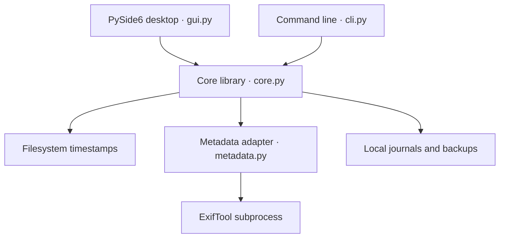

# DateFix architecture

DateFix has one implementation of date operations, used by two adapters. The core can be imported without Qt, a display server, or third-party Python packages.



## Components

| Component | Owns | Does not own |
| --- | --- | --- |
| `core.py` | Discovery, calendar arithmetic, plans, file checks, application, rollback and undo | User interface or command parsing |
| `metadata.py` | ExifTool discovery, explicit capture-tag support, reading, writing and verification | Batch policy or UI state |
| `cli.py` | Argument parsing, human/JSON output and exit codes | Timestamp calculations |
| `gui.py` | File selection, controls, preview display and worker lifecycle | Date rules or metadata format handling |

The desktop uses a worker object on a `QThread` for long operations. Editing and dropping new files are disabled while it runs. Changing inputs clears the current plan, and Apply remains disabled until a new usable preview exists. GUI imports are deferred, keeping the CLI independent of PySide6.

## Core API

```python
from pathlib import Path
from datefix.core import Offset, Request, discover, preview, apply, undo

files = discover([Path("/path/to/media")], recursive=True)
request = Request(
    offset=Offset(years=2, days=16, hours=6),
    targets=("modified",),
    timezone="local",
)
plan = preview(files, request)

# Inspect plan.files: path, changes, warnings and errors.
# Only proceed after the calling application has reviewed the proposed edits.
result = apply(plan, journal_dir=Path("/path/to/history"))

# Later, restore that run when requested by the caller.
if result.journal_path:
    restored = undo(result.journal_path)
```

`Request` takes exactly one of `offset` or `fixed`. A fixed value is a Python `datetime`; an aware value identifies an instant, and a naive value uses the selected timezone for filesystem dates. Targets are `modified`, `created` and `captured`. `Offset` contains integer years, days, hours, minutes and seconds; negative values subtract.

`preview()` takes explicit file paths. Use `discover()` to expand directories first. A `Plan` contains a `FilePlan` for each discovered path. Each `Change` exposes `field`, `before` and `after` strings for presentation. Capture fields include their metadata group, for example `captured:ExifIFD:DateTimeOriginal`.

`apply()` and `undo()` return a `Result` with per-file statuses (`applied`, `undone`, `skipped`, `error`) and an optional journal path. Both accept a progress callback `(completed, total, path)`; callback exceptions do not interrupt file recovery. Files with errors are independent of other batch members.

`plan_to_dict()` and `plan_from_dict()` support library serialization with validation. Imported executable paths are not trusted as runtime configuration. The CLI's `--json` preview is for inspection; the CLI intentionally has no command that executes an imported preview file.

## Dates and platform boundaries

Filesystem timestamps are represented internally as integer nanoseconds. Calendar arithmetic applies years first, clamps leap days when necessary, then adds the remaining components. Shifts retain the original subsecond precision where the filesystem permits it. Local arithmetic checks for invalid daylight-saving wall times; UTC gives timezone-independent arithmetic.

Windows creation time is read from the platform's birth-time information and written through `SetFileTime`. Linux modification time is supported through `os.utime`; Linux inode-change time is not exposed as an editable creation date.

QuickTime integer dates are interpreted as UTC and use the request's local/UTC calendar rules. True string capture dates retain explicit offsets, including EXIF offsets stored in companion tags. Unzoned capture values remain wall-clock dates, with a warning for fixed-time requests. These rules live in the core/metadata boundary rather than either frontend.

## Metadata engine

ExifTool is an optional external executable. Discovery supports explicit configuration through `DATEFIX_EXIFTOOL`, a bundled project/application engine and `PATH`. The CLI also accepts an explicit `--exiftool` path. Missing ExifTool does not prevent filesystem-only work.

The adapter accepts an intentionally limited set of media extensions and existing capture tags. It does not update arbitrary metadata, invent missing dates, or decode/re-encode image pixels or video streams. ExifTool may rewrite the surrounding file structure when saving metadata.

Calls use argument lists and UTF-8 argument input without a shell. ExifTool user configuration is disabled. Reads use group and instance identities to expose duplicate capture tags; ambiguous duplicates are refused. Writes request existing tags only, then read back and compare their values. QuickTime operations run with an explicit UTC engine environment to avoid accidental host-timezone conversions.

Supported fields include EXIF DateTimeOriginal/CreateDate, selected XMP creation dates, QuickTime movie/track/media creation dates, and selected Keys/UserData/ItemList capture dates. Refer to the constants in `metadata.py` for the exact list. AVI embedded writing is excluded because the underlying [ExifTool RIFF implementation](https://github.com/exiftool/exiftool/blob/master/lib/Image/ExifTool/RIFF.pm) does not support it.

## Application and recovery

1. Preview records original dates and file identity. Capture previews also fingerprint the content and record the source capture values.
2. Before writing, apply validates the plan and checks that the file still matches its preview.
3. A run directory receives a journal. Embedded edits also receive verified, complete file backups.
4. The file's pending operation is recorded before mutation. The adapter saves selected changes and verifies the result; unselected filesystem timestamps are preserved where supported.
5. Success records the resulting state. On failure after mutation, the core attempts to restore original content and timestamps, then reports the outcome.
6. Undo checks that the current file still matches the recorded result, validates any backup and restores the original values. Files with newer changes are refused.

Journal state distinguishes prepared, applied, restored/rolled-back and recovery-required cases. Journal updates use a temporary file, flushing and atomic replacement. This is a per-file recovery mechanism, not a transaction across an entire batch. A crash, disk failure or concurrent external writer can still require manual recovery; backups are retained rather than silently discarded.

Only regular, non-linked files are eligible. Original absolute paths are recorded, so moving or renaming media between application and undo requires resolving those paths before restoration. A field unsupported by the platform or format prevents all changes to that file, while other valid files remain eligible.

## Testing and distribution

Core and CLI tests require no GUI dependency. GUI tests run offscreen when PySide6 is installed. CLI tests launch real subprocesses, including Python without site packages to check that Qt is not accidentally required. Integration checks use disposable copies or generated media; sample originals are not edited.

The Windows portable distribution contains separate GUI and console launchers with the shared core, Qt runtime and ExifTool. Source installs use the optional `desktop` extra; Linux additionally needs system libraries for the selected [Qt platform plugin](https://doc.qt.io/qt-6/linux-requirements.html). Native Linux runtime verification remains outstanding for this development session.
